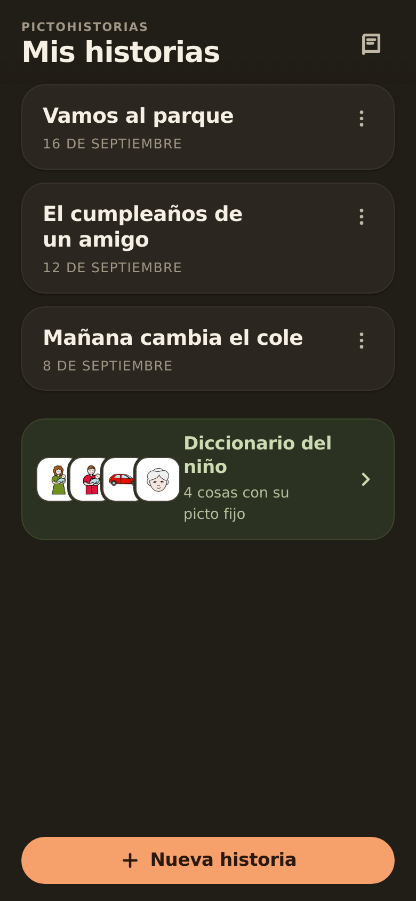
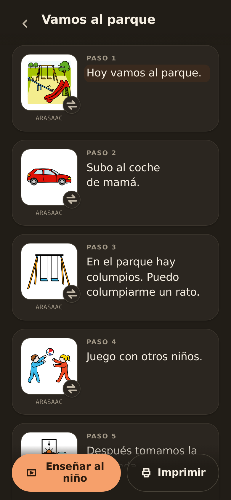
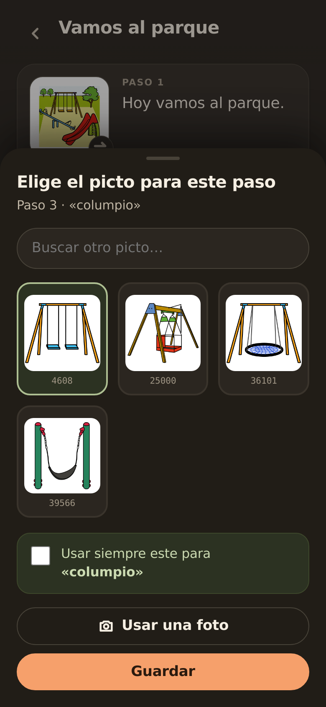
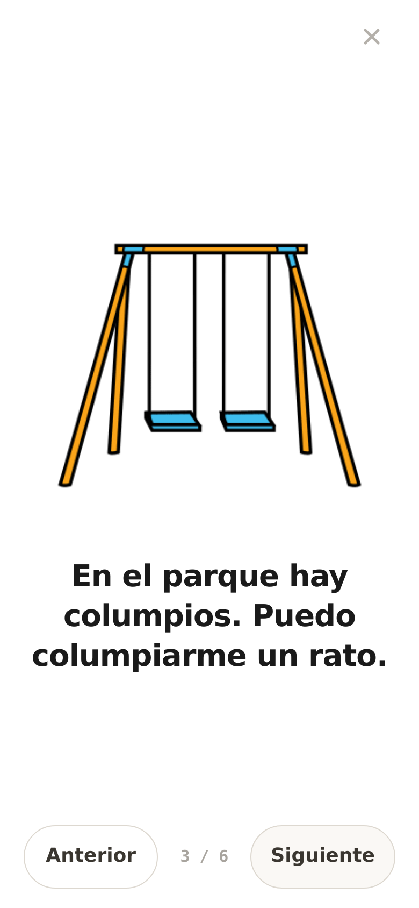
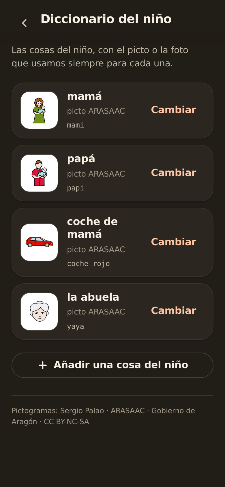

# PictoHistorias

**Historias sociales con pictogramas ARASAAC, generadas con IA a partir de una frase.**

Un adulto escribe con sus palabras lo que va a pasar ("mañana llevamos el coche al taller y nos quedamos esperando") y la app devuelve una historia social ya montada: frases cortas en primera persona, un pictograma por paso, lista para enseñar desde el móvil. Está pensada para acompañar a niños con autismo y comunicación no verbal, que entienden mejor lo que va a ocurrir cuando se les anticipa con frases simples e imágenes.

<p align="center">
  
  
  
  
  
</p>

## Qué es una historia social

Una **historia social** es un relato corto y personalizado que describe una situación (qué va a pasar, quién estará, cuánto durará, qué se puede notar o sentir) con un lenguaje claro y concreto, para que a una persona autista le resulte más predecible. Las desarrolló Carol Gray en 1991. Se suelen escribir en primera persona y en presente, y se leen antes de que ocurra la situación, en un sitio tranquilo y con actitud positiva. En comunicación aumentativa (CAA) se acompañan de pictogramas.

PictoHistorias automatiza la parte más laboriosa, que es redactar la historia y buscar una imagen para cada paso, siguiendo esas ideas: primera persona, presente, frases cortas, sin imperativos y con un cierre tranquilizador. **No es un método clínico ni garantiza cumplir los criterios formales de Gray**, y no sustituye a un profesional. Además, la evidencia sobre su eficacia es mixta: las revisiones encuentran efectos modestos e inconsistentes, así que conviene usarlas como herramienta de apoyo y no como intervención única.

Para saber más:
- [Sitio oficial de Carol Gray sobre Social Stories](https://carolgraysocialstories.com/social-stories/) (en inglés).
- [Cómo elaborar una historia social con pictogramas](https://aulaabierta.arasaac.org/minitutoriales-caa-elaborando-una-historia-social-con-pictogramas-2), tutorial del Aula Abierta de ARASAAC (en español).
- [Social Stories en Wikipedia](https://en.wikipedia.org/wiki/Social_Stories) (en inglés), con un resumen de la investigación sobre su eficacia.

## Qué hace

1. **Genera la historia.** Claude Sonnet convierte el texto libre en 4-8 pasos cortos, en primera persona y en presente, con un paso final tranquilizador. Las reglas de estilo viven en [`backend/prompts/historia.md`](backend/prompts/historia.md).
2. **Elige un pictograma por paso**, en este orden:
   1. el **diccionario propio** (conceptos que la familia ha fijado a un pictograma o a una foto),
   2. una **coincidencia exacta** por palabra clave en el catálogo ARASAAC,
   3. una **búsqueda semántica** (embeddings + Qdrant) con umbral de similitud,
   4. si nada encaja, el paso se queda sin imagen para elegirla a mano.
3. **Se puede corregir todo.** Cambiar el pictograma, subir una foto real, editar las frases, y "usar siempre este para X" para fijar una imagen en el diccionario y que salga igual en las historias siguientes.
4. **Modo enseñar.** Pantalla completa, un paso cada vez, con el pictograma grande y la frase debajo, para pasar con un dedo.
5. **Imprimible** en A4 (dos columnas, un pictograma por paso).

## Stack necesario

| Pieza | Para qué | Notas |
|---|---|---|
| Python 3.11 | Backend | FastAPI + uvicorn, síncrono, sin ORM |
| MariaDB | Metadatos del catálogo, historias, diccionario | Acceso con PyMySQL |
| Qdrant | Búsqueda semántica de pictogramas | Colección `arasaac_es`, 1536 dimensiones, distancia coseno. Probado con servidor 1.17 |
| JavaScript vanilla | Frontend | Un único `frontend/index.html`, sin build ni dependencias |
| nginx | Producción | Sirve el frontend y las imágenes, y hace de proxy de `/api/` |
| systemd | Producción | Un servicio para el backend |
| Pillow | Fotos | Redimensiona, corrige la orientación y elimina EXIF |
| `cloudflared` | Opcional | Acceso remoto con Cloudflare Tunnel + Access |

## Requisitos de hardware

Está pensada para dejarla encendida todo el día en un equipo pequeño. La IA pesada (redactar la historia y calcular embeddings) la hacen Anthropic y OpenAI por API, así que el equipo solo orquesta: no hace falta GPU ni un procesador potente.

**Consumo medido** en mi servidor de desarrollo (x86_64), con el catálogo completo de 13.827 pictogramas indexado:

| Pieza | RAM | Disco |
|---|---|---|
| Qdrant | ~160 MB | ~125 MB |
| Backend (uvicorn) | ~200 MB | — |
| MariaDB | hasta ~260 MB (instancia compartida con otros proyectos: es una cota superior) | no medido |
| nginx | ~20 MB | — |
| Caché de pictogramas (`cache/pictos/`) | — | ~90 KB por pictograma usado (113 usados = 10 MB). Techo teórico si se usara el catálogo entero: ~1,2 GB |
| Fotos propias (`fotos/`) | — | JPEG de 600 px; 236 KB en mi uso |

En marcha, unos **0,6-0,7 GB de RAM** en total.

| Equipo | ¿Sirve? |
|---|---|
| **Raspberry Pi 5 o 4, 4 GB o más, sistema de 64 bits** | Sí, recomendado. Qdrant publica binario `aarch64` e imagen Docker arm64 |
| Raspberry Pi 4/5 de 2 GB | Justo. Aguanta en marcha, pero la ingesta inicial puede quedarse sin memoria (nota abajo) |
| Raspberry Pi 3, Zero 2 W (1 GB o menos) | No recomendado |
| Mini PC x86 (tipo N100), portátil viejo, NAS con Docker | Sí, y más cómodo |
| Arduino, ESP32, Raspberry Pi Pico | **No.** Son microcontroladores con KB de RAM: no ejecutan Python, MariaDB ni Qdrant |

Notas:
- **Ingesta inicial.** Se hace una sola vez y mantiene en memoria los 13.800 vectores de 1536 dimensiones antes de subirlos. Por cálculo, el pico es del orden de 1 GB (estimación, no medida). Con 2 GB, añade swap.
- **Disco.** Al menos 16 GB libres. Mejor un SSD por USB o una tarjeta SD de gama alta: MariaDB escribe a menudo y las tarjetas baratas se degradan.
- **Copias de seguridad.** Lo insustituible son la base de datos (`mysqldump`) y `fotos/`. El catálogo y los pictogramas se regeneran (la ingesta cuesta céntimos).
- **Python 3.11** es el que uso. Con otras versiones no lo he probado; en sistemas recientes la versión por defecto puede ser otra, comprueba `python3 --version`.
- **No lo he probado en una Raspberry Pi.** Las cifras de arriba son del servidor x86; para ARM son estimaciones. Si lo montas, cuéntame qué tal.

## APIs y servicios externos

| Servicio | Uso | Clave | Qué recibe |
|---|---|---|---|
| **Anthropic** (`claude-sonnet-4-6`) | Generar la historia | `ANTHROPIC_API_KEY` | El texto escrito y los nombres de los conceptos del diccionario. Solo texto |
| **OpenAI** (`text-embedding-3-small`) | Embeddings del catálogo (una vez) y de cada concepto buscado | `OPENAI_API_KEY` | Textos cortos de conceptos |
| **ARASAAC** ([api.arasaac.org](https://api.arasaac.org), [static.arasaac.org](https://static.arasaac.org)) | Metadatos del catálogo (una vez) e imágenes PNG bajo demanda | Ninguna | Ids de pictograma y, solo si falla Qdrant, el término de búsqueda |
| **Cloudflare Access** | Opcional. Verifica el JWT de las peticiones que llegan por el túnel | `CLOUDFLARE_*` | Nada: solo se descargan sus claves públicas |

El coste es bajo: indexar el catálogo completo (~13.800 pictogramas) son textos muy cortos, del orden de céntimos, y el uso normal (decenas de historias al mes) es residual. Son estimaciones, no una medición.

### Privacidad

- **Las fotos nunca salen del servidor.** Se guardan en local (JPEG de 600 px, sin EXIF, con nombre aleatorio) y no se envían a ningún LLM ni servicio externo.
- La aplicación **no tiene usuarios ni contraseñas**. No la expongas tal cual a internet: pon delante Tailscale, una VPN o Cloudflare Access ([guía](guias/acceso-remoto.md)). En particular, **no uses `tailscale funnel`**, que la publicaría a todo internet.

## Puesta en marcha

Necesitas MariaDB y Qdrant accesibles, y una clave de OpenAI y otra de Anthropic.

Se ha desarrollado y usado en mi servidor de desarrollo (Ubuntu 22.04, x86_64, con MariaDB, Qdrant 1.17 y nginx). No lo he probado montándolo desde cero en otra máquina, así que si algún paso falla, abre una issue.

```bash
git clone <este-repo> && cd pictohistorias
make install                 # crea .venv e instala dependencias
cp .env.example .env         # rellena credenciales y claves
```

**Base de datos.** Edita `db/00-create-db-and-user.sql` y sustituye el placeholder `<PASSWORD>` por una contraseña real; usa esa misma en `DB_PASSWORD` del `.env`. Después:

```bash
mysql -u root -p < db/00-create-db-and-user.sql
mysql -u <usuario> -p <basedatos> < db/schema.sql
```

**Catálogo de pictogramas (solo metadatos).** La ingesta descarga de ARASAAC únicamente el índice de texto: palabras clave, significados, categorías y etiquetas de cada pictograma. Lo guarda en MariaDB (y una copia del JSON en `cache/arasaac_all_es.json`) y lo indexa en Qdrant. **No descarga ninguna imagen**: cada PNG se baja de ARASAAC la primera vez que un pictograma entra en una historia o en el diccionario, y se cachea en `cache/pictos/`, por lo que el disco solo crece con lo que se usa. La ingesta se hace una sola vez y es idempotente:

```bash
make ingest-sample           # prueba rápida con 50 pictogramas
make ingest                  # catálogo completo (~13.800 pictogramas, solo texto)
make buscar q="coche"        # comprueba que la búsqueda devuelve algo razonable
```

**Arrancar.**

```bash
make dev                     # app completa en http://127.0.0.1:8002/
```

Para dejarla siempre encendida: `pictohistorias-backend.service` (systemd) y `nginx-pictohistorias.conf` (nginx). Ojo: el `.service` y el nginx asumen el proyecto en `/data/pictohistorias` y el usuario `ubuntu`, así que ajústalos a tu instalación. `make install-services` instala el servicio; `make deploy` instala el nginx, que está pensado para [Tailscale](guias/acceso-remoto.md) (sustituye `TAILSCALE_IP` por la salida de `tailscale ip -4`). Si no lo usas, edita la línea `listen` de `nginx-pictohistorias.conf`.

## Configuración

Todo va en `.env` (plantilla en [`.env.example`](.env.example)).

| Variable | Descripción |
|---|---|
| `DB_HOST`, `DB_PORT`, `DB_USER`, `DB_PASSWORD`, `DB_NAME` | Conexión a MariaDB |
| `OPENAI_API_KEY` | Embeddings |
| `ANTHROPIC_API_KEY` | Generación de historias |
| `QDRANT_URL`, `QDRANT_COLLECTION` | Qdrant (por defecto `http://localhost:6333` y `arasaac_es`) |
| `ARASAAC_LOCALE`, `ARASAAC_API_BASE`, `ARASAAC_STATIC_BASE` | Catálogo ARASAAC |
| `LOGCENTRAL_LOG_DIR` | Carpeta de logs (JSON, una línea por evento) |
| `NOMBRE_NINO` | Opcional. Nombre del niño para la interfaz: con `NOMBRE_NINO=Leo` los textos dicen "Enseñar a Leo" y "Diccionario de Leo". Vacío, dicen "el niño". Solo afecta a la interfaz; el nombre no se envía al modelo |
| `CLOUDFLARE_TUNNEL_TOKEN`, `CLOUDFLARE_TEAM`, `CLOUDFLARE_ACCESS_AUD`, `USUARIOS_MAPA` | Solo si usas Cloudflare ([guía](guias/acceso-remoto.md#con-cloudflare-tunnel--access)) |

## Verlo en el móvil

Esta guía deja la app funcionando en local. Para abrirla desde los móviles de la familia, desde casa o desde la calle, sin exponerla a internet, hay una guía aparte con **Tailscale** (lo más sencillo) y con **Cloudflare Tunnel + Access**: [`guias/acceso-remoto.md`](guias/acceso-remoto.md).

## Comandos

| Comando | Qué hace |
|---|---|
| `make install` | Entorno virtual y dependencias |
| `make ingest-sample` / `make ingest` | Ingesta de los metadatos del catálogo ARASAAC (50 pictogramas / completo), sin imágenes |
| `make buscar q="..."` | Búsqueda de pictogramas desde la terminal |
| `make dev` / `make dev-be` | Backend + frontend estático en background / solo backend con recarga |
| `make stop` / `make status` | Para o consulta el proceso de `make dev` |
| `make test` | Suite de tests |
| `make install-services` | Instala el servicio systemd (`sudo`) |
| `make deploy` | Instala la configuración de nginx (`sudo`) |
| `make install-cloudflared` | Instala `cloudflared` como servicio (`sudo`) |

## Arquitectura

```
navegador ──► nginx :5252 ─┬─ /          frontend/index.html
                           ├─ /api/*     ──► uvicorn 127.0.0.1:8002 (FastAPI)
                           ├─ /pictos/*  cache de PNG de ARASAAC en disco
                           └─ /fotos/*   fotos propias

FastAPI ─┬─ MariaDB   historias, pasos, diccionario, catálogo
         ├─ Qdrant    búsqueda semántica de pictogramas
         ├─ Anthropic generación de la historia (solo texto)
         └─ OpenAI    embeddings
```

## Tests

```bash
make test
```

La suite usa dobles para MariaDB, Qdrant, Anthropic y OpenAI, así que no llama a esas APIs ni necesita esos servicios en marcha. Sí necesita las variables obligatorias definidas en `.env` o en el entorno (`DB_USER`, `DB_PASSWORD`, `OPENAI_API_KEY`, `ANTHROPIC_API_KEY`); valen valores ficticios. Los logs usan [`loguru`](https://github.com/Delgan/loguru); si tienes instalado el cliente de LogCentral (`logcentral_client`) se usa ese.

## Atribución y licencias

**Pictogramas: Sergio Palao. Origen: ARASAAC ([arasaac.org](https://arasaac.org)). Licencia: [CC BY-NC-SA](https://creativecommons.org/licenses/by-nc-sa/4.0/). Propiedad: Gobierno de Aragón (España).**

Esta aplicación es de uso no comercial. No redistribuye el catálogo: descarga cada pictograma de ARASAAC la primera vez que se usa y lo cachea en local (`cache/` está fuera del repositorio). La propia app muestra la atribución al pie de las historias y del diccionario, y las capturas de este README incluyen algunos pictogramas bajo la misma licencia.

**Código: [MIT](LICENSE).** La licencia MIT cubre solo el código, no los pictogramas.
